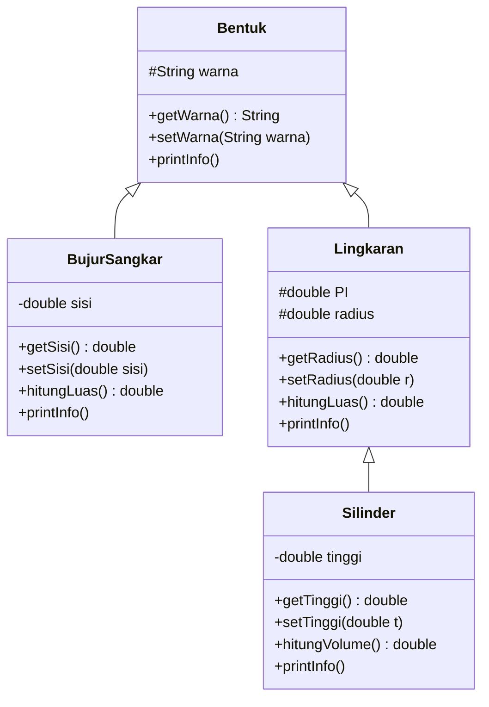

a<div align="center">

# ☕ Latihan Pewarisan di Java

### Bentuk • Bujur Sangkar • Lingkaran • Silinder


*Latihan mata kuliah **Pemrograman Berorientasi Objek (PBO)** pertemuan 5 & 6*

</div>

---

## 📑 Daftar Isi

1. [📖 Tentang Proyek](#-tentang-proyek)
2. [🌳 Struktur Pewarisan](#-struktur-pewarisan)
3. [📁 Daftar File](#-daftar-file)
4. [🧩 Penjelasan Kelas](#-penjelasan-kelas)
5. [🧠 Penerapan Tiga Pilar OOP](#-penerapan-tiga-pilar-oop)
   - [🗺️ Peta Kode Singkat](#️-peta-kode-singkat)
   - [🔒 Encapsulation](#-1-encapsulation-enkapsulasi)
   - [🧬 Inheritance](#-2-inheritance-pewarisan)
   - [🎭 Polymorphism](#-3-polymorphism-polimorfisme)
6. [🚀 Cara Menjalankan](#-cara-menjalankan)
7. [📸 Screenshot](#-screenshot)
8. [📺 Contoh Keluaran](#-contoh-keluaran)
9. [👤 Identitas](#-identitas)

---

## 📖 Tentang Proyek

Proyek ini adalah latihan untuk mempraktikkan tiga pilar pemrograman berorientasi objek (OOP) di Java:

- 🔒 **Encapsulation**: menyembunyikan data dan mengaksesnya lewat *getter* dan *setter*
- 🧬 **Inheritance**: membuat kelas turunan dengan `extends` dan memanggil konstruktor induk dengan `super(...)`
- 🎭 **Polymorphism**: *overriding* method `printInfo()` sehingga satu pemanggilan menghasilkan perilaku yang berbeda untuk tiap objek

Ada empat kelas yang saling berhubungan: `Bentuk` sebagai induk, `BujurSangkar` dan `Lingkaran` sebagai anaknya, serta `Silinder` sebagai anak dari `Lingkaran`.

---

## 🌳 Struktur Pewarisan

```
Bentuk
 ├── BujurSangkar
 └── Lingkaran
       └── Silinder
```

- 👨‍👧‍👦 `BujurSangkar` dan `Lingkaran` adalah **saudara**, keduanya anak langsung dari `Bentuk`.
- 👶 `Silinder` adalah **cucu**: anak dari `Lingkaran`, sehingga secara tidak langsung juga turunan `Bentuk` (pewarisan bertingkat / *multilevel*).

Diagram kelas:



---

## 📁 Daftar File

| 📄 File | 📝 Keterangan |
|---|---|
| `Bentuk.java` | Kelas induk paling atas. Menyimpan atribut `warna`. |
| `BujurSangkar.java` | Turunan `Bentuk`. Menambah atribut `sisi` dan perhitungan luas bujur sangkar. |
| `Lingkaran.java` | Turunan `Bentuk`. Menambah atribut `radius` dan perhitungan luas lingkaran. |
| `Silinder.java` | Turunan `Lingkaran`. Menambah atribut `tinggi` dan perhitungan volume silinder. |
| `Main.java` | Program utama untuk membuat objek dan menguji semua kelas, termasuk demo polimorfisme. |

---

## 🧩 Penjelasan Kelas

### 🔷 `Bentuk` (kelas induk)

| Anggota | Keterangan |
|---|---|
| `protected String warna` | Warna bentuk |
| `Bentuk(String warna)` | Konstruktor, mengisi `warna` |
| `getWarna()` | Mengembalikan nilai `warna` |
| `setWarna(String warna)` | Mengubah nilai `warna` |
| `printInfo()` | Mencetak `Bentuk berwarna [warna]` |

### 🟦 `BujurSangkar` (extends `Bentuk`)

| Anggota | Keterangan |
|---|---|
| `private double sisi` | Panjang sisi |
| `BujurSangkar(double sisi, String warna)` | Konstruktor, memanggil `super(warna)` lalu mengisi `sisi` |
| `getSisi()` / `setSisi(double sisi)` | Membaca / mengubah `sisi` |
| `hitungLuas()` | Mengembalikan `sisi * sisi` |
| `printInfo()` | Mencetak `Bujur sangkar berwarna [warna], luas [luas]` |

### 🔵 `Lingkaran` (extends `Bentuk`)

| Anggota | Keterangan |
|---|---|
| `protected static final double PI` | Konstanta kelas untuk pi, nilainya `3.1428` |
| `protected double radius` | Jari-jari |
| `Lingkaran(double radius, String warna)` | Konstruktor, memanggil `super(warna)` lalu mengisi `radius` |
| `getRadius()` / `setRadius(double r)` | Membaca / mengubah `radius` |
| `hitungLuas()` | Mengembalikan `PI * radius * radius` |
| `printInfo()` | Mencetak `Lingkaran [warna], luas = [luas]` |

### 🥫 `Silinder` (extends `Lingkaran`)

| Anggota | Keterangan |
|---|---|
| `private double tinggi` | Tinggi silinder |
| `Silinder(double tinggi, double radius, String warna)` | Konstruktor, memanggil `super(radius, warna)` lalu mengisi `tinggi` |
| `getTinggi()` / `setTinggi(double t)` | Membaca / mengubah `tinggi` |
| `hitungVolume()` | Mengembalikan `hitungLuas() * tinggi` (memakai ulang rumus luas dari `Lingkaran`) |
| `printInfo()` | Mencetak `Silinder [warna], volume = [volume]` |

---

## 🧠 Penerapan Tiga Pilar OOP

### 🗺️ Peta Kode Singkat

Tabel ini menunjukkan **bagian kode mana** yang menjadi bukti tiap pilar OOP.

| Pilar | File | Baris | Bagian kodenya |
|---|---|---|---|
| 🔒 **Encapsulation** | `Bentuk.java` | 2, 8–14 | `protected String warna` + `getWarna()` / `setWarna()` |
| | `BujurSangkar.java` | 2, 9–15 | `private double sisi` + `getSisi()` / `setSisi()` |
| | `Lingkaran.java` | 2–3, 10–16 | `PI` konstanta, `protected double radius` + `getRadius()` / `setRadius()` |
| | `Silinder.java` | 2, 9–15 | `private double tinggi` + `getTinggi()` / `setTinggi()` |
| 🧬 **Inheritance** | `BujurSangkar.java` | 1, 5 | `extends Bentuk` dan `super(warna)` |
| | `Lingkaran.java` | 1, 6 | `extends Bentuk` dan `super(warna)` |
| | `Silinder.java` | 1, 5, 18 | `extends Lingkaran`, `super(radius, warna)`, dan memakai ulang `hitungLuas()` |
| 🎭 **Polymorphism** | `Bentuk.java` | 16–18 | `printInfo()` versi induk |
| | `BujurSangkar.java` | 21–24 | `@Override printInfo()` |
| | `Lingkaran.java` | 22–25 | `@Override printInfo()` |
| | `Silinder.java` | 21–24 | `@Override printInfo()` |
| | `Main.java` | 18–25 | array `Bentuk[]` berisi objek berbeda, dipanggil dalam satu *loop* |

---

### 🔒 1. Encapsulation (Enkapsulasi)

**Idenya:** data disembunyikan di dalam kelas, dan pihak luar hanya boleh mengaksesnya lewat method (*getter* dan *setter*).

**Di mana penerapannya?** Atribut dibuat `private` atau `protected` (bukan `public`), lalu disediakan *getter* dan *setter*.

📄 `BujurSangkar.java` baris 2 dan 9–15:

```java
private double sisi;                 // data disembunyikan

public double getSisi() {            // getter: untuk membaca
    return sisi;
}

public void setSisi(double sisi) {   // setter: untuk mengubah
    this.sisi = sisi;
}
```

📄 `Bentuk.java` baris 2 dan 8–14:

```java
protected String warna;              // hanya kelas turunan yang boleh memakai langsung

public String getWarna() { return warna; }
public void setWarna(String warna) { this.warna = warna; }
```

📄 `Lingkaran.java` baris 2:

```java
protected static final double PI = 3.1428;   // konstanta kelas, nilainya tidak bisa diubah
```

**Buktinya di `Main.java`:** `Main` tidak mengubah `sisi` secara langsung (`bujur.sisi = 5` akan *error*). `Main` memakai `bujur.getSisi()` dan `bujur.setSisi(...)`.

> [!TIP]
> Saat ini *setter* belum memeriksa nilai (misalnya sisi negatif masih diterima). Jika ingin pengembangan, tambahkan pemeriksaan `if (sisi > 0)` di `setSisi()` agar enkapsulasi benar-benar melindungi data.

---

### 🧬 2. Inheritance (Pewarisan)

**Idenya:** kelas anak memakai ulang atribut dan method milik kelas induk, sehingga tidak perlu menulis ulang.

**Di mana penerapannya?** Kata kunci `extends` (menurunkan) dan `super(...)` (memanggil konstruktor induk).

📄 `BujurSangkar.java` baris 1 dan 4–7:

```java
public class BujurSangkar extends Bentuk {      // BujurSangkar mewarisi Bentuk
    ...
    public BujurSangkar(double sisi, String warna) {
        super(warna);        // panggil konstruktor Bentuk (wajib baris pertama)
        this.sisi = sisi;    // urus bagian milik sendiri
    }
```

📄 `Silinder.java` baris 1 dan 4–7 (pewarisan bertingkat):

```java
public class Silinder extends Lingkaran {       // Silinder mewarisi Lingkaran
    ...
    public Silinder(double tinggi, double radius, String warna) {
        super(radius, warna);   // kirim radius & warna ke Lingkaran
        this.tinggi = tinggi;
    }
```

📄 `Silinder.java` baris 17–19 (penggunaan ulang kode):

```java
public double hitungVolume() {
    return hitungLuas() * tinggi;   // hitungLuas() diwarisi dari Lingkaran
}
```

**Buktinya:** `Silinder` tidak menulis atribut `warna` maupun rumus luas lingkaran, tetapi dapat memakai keduanya karena diwarisi dari `Lingkaran` dan `Bentuk`.

> [!NOTE]
> **Urutan pembuatan objek `Silinder`:** `Bentuk` → `Lingkaran` → `Silinder`.
> Induk selalu selesai dibangun lebih dulu, baru anaknya. Karena itu `super(...)` wajib berada di baris pertama konstruktor.

---

### 🎭 3. Polymorphism (Polimorfisme)

**Idenya:** pemanggilan method yang **sama** menghasilkan perilaku yang **berbeda** tergantung objek aslinya.

**Di mana penerapannya?** Method `printInfo()` ditulis di induk (`Bentuk`), lalu ditimpa (*override*) di setiap anak dengan isi yang berbeda.

📄 `Bentuk.java` baris 16–18 (versi induk):

```java
public void printInfo() {
    System.out.println("Bentuk berwarna " + warna);
}
```

📄 `Lingkaran.java` baris 22–25 (ditimpa di anak):

```java
@Override
public void printInfo() {
    System.out.println("Lingkaran " + warna + ", luas = " + hitungLuas());
}
```

📄 `Silinder.java` baris 21–24 (ditimpa lagi):

```java
@Override
public void printInfo() {
    System.out.println("Silinder " + warna + ", volume = " + hitungVolume());
}
```

📄 `Main.java` baris 18–25 (**inilah bukti polimorfisme yang paling jelas**):

```java
Bentuk[] daftar = new Bentuk[3];   // semua variabel bertipe Bentuk
daftar[0] = bujur;                 // isinya BujurSangkar
daftar[1] = lingkaran;             // isinya Lingkaran
daftar[2] = silinder;              // isinya Silinder

for (Bentuk b : daftar) {
    b.printInfo();   // pemanggilannya SAMA, hasilnya BERBEDA-BEDA
}
```

**Buktinya:** ketiga variabel bertipe `Bentuk`, tetapi `printInfo()` yang jalan adalah milik objek aslinya, sehingga keluarannya berbeda untuk bujur sangkar, lingkaran, dan silinder.

> [!NOTE]
> Jenis polimorfisme yang dipakai di proyek ini adalah ***overriding*** (diputuskan saat program berjalan / *run-time*). *Overloading* (nama method sama, parameter berbeda) tidak dipakai di proyek ini.

---

## 🚀 Cara Menjalankan

Pastikan **JDK** (Java Development Kit) sudah terpasang, lalu buka terminal pada folder yang berisi kelima file `.java`.

**1️⃣ Kompilasi semua file:**

```bash
javac *.java
```

**2️⃣ Jalankan program utama:**

```bash
java Main
```

> [!IMPORTANT]
> Semua file harus berada di **folder yang sama**, dan nama setiap file harus sama persis dengan nama kelas `public` di dalamnya.

---

## 📸 Screenshot

> Ganti gambar di bawah dengan screenshot dari komputer Anda sendiri. Simpan semua gambar di folder `screenshots/` pada repository.

### 1️⃣ Hasil keluaran program


*Screenshot terminal / IDE setelah menjalankan `java Main`, memperlihatkan seluruh keluaran termasuk bagian "Demo Polimorfisme".*

### 2️⃣ Struktur file proyek


*Screenshot daftar kelima file `.java` di dalam folder proyek atau di panel *Project* IDE.*

### 3️⃣ (Opsional) Kode yang menunjukkan pilar OOP


*Screenshot bagian `Main.java` baris 18–25 yang menunjukkan array `Bentuk[]`.*

| 📷 Nama file gambar | Isi screenshot |
|---|---|
| `screenshots/hasil-output.png` | Keluaran program di terminal / IDE |
| `screenshots/struktur-file.png` | Daftar file proyek |
| `screenshots/kode-polimorfisme.png` | Potongan kode demo polimorfisme |

> [!TIP]
> Cara mengambil screenshot: di Windows tekan `Win + Shift + S`, di Mac tekan `Cmd + Shift + 4`. Setelah itu simpan hasilnya dengan nama persis seperti di tabel, lalu upload ke folder `screenshots/` di GitHub.

---

## 📺 Contoh Keluaran

Objek yang dibuat di `Main.java`:

| Objek | Parameter |
|---|---|
| 🟦 `BujurSangkar` | sisi = 2, warna = Merah |
| 🔵 `Lingkaran` | radius = 7, warna = Biru |
| 🥫 `Silinder` | tinggi = 2, radius = 7, warna = Hijau |

Keluaran program:

```
Sisi bujur sangkar: 2.0
Bujur sangkar berwarna Merah, luas 4.0
Radius lingkaran: 7.0
Lingkaran Biru, luas = 153.9972
Tinggi silinder: 2.0
Silinder Hijau, volume = 307.9944

=== Demo Polimorfisme ===
Bujur sangkar berwarna Merah, luas 4.0
Lingkaran Biru, luas = 153.9972
Silinder Hijau, volume = 307.9944
```

🧮 Cara menghitungnya:

- Luas bujur sangkar = 2 × 2 = **4.0**
- Luas lingkaran = 3.1428 × 7 × 7 = **153.9972**
- Volume silinder = luas lingkaran × tinggi = 153.9972 × 2 = **307.9944**

---

## 👤 Identitas

| | |
|---|---|
| **Nama** | _Naira Almira_ |
| **NIM** | _F1D02510085_ |
| **Kelas** | _B_ |
| **Mata Kuliah** | Pemrograman Berorientasi Objek (PBO) |

<div align="center">

⭐ *Jika proyek ini membantu, jangan lupa beri bintang!* ⭐

</div>
