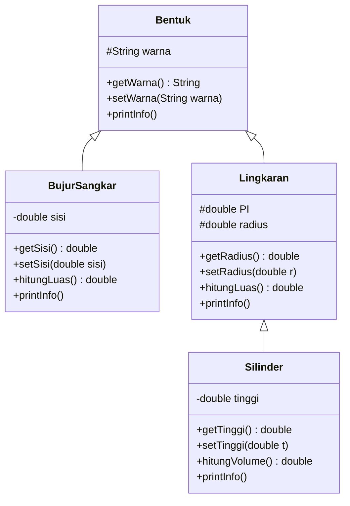

a<div align="center">

# ☕ Latihan Pewarisan di Java

### Bentuk • Bujur Sangkar • Lingkaran • Silinder


*Latihan mata kuliah **Pemrograman Berorientasi Objek (PBO)** pertemuan 5 & 6*

</div>

---

## 📖 Tentang Proyek

Proyek ini adalah latihan untuk mempraktikkan tiga pilar pemrograman berorientasi objek (OOP) di Java:

- 🔒 **Encapsulation**: menyembunyikan data dan mengaksesnya lewat *getter* dan *setter*
- 🧬 **Inheritance**: membuat kelas turunan dengan `extends` dan memanggil konstruktor induk dengan `super(...)`
- 🎭 **Polymorphism**: *overriding* method `printInfo()` sehingga satu pemanggilan menghasilkan perilaku yang berbeda untuk tiap objek

Ada empat kelas yang saling berhubungan: `Bentuk` sebagai induk, `BujurSangkar` dan `Lingkaran` sebagai anaknya, serta `Silinder` sebagai anak dari `Lingkaran`.

---

## 🌳 Struktur Pewarisan

```
Bentuk
 ├── BujurSangkar
 └── Lingkaran
       └── Silinder
```

- 👨‍👧‍👦 `BujurSangkar` dan `Lingkaran` adalah **saudara**, keduanya anak langsung dari `Bentuk`.
- 👶 `Silinder` adalah **cucu**: anak dari `Lingkaran`, sehingga secara tidak langsung juga turunan `Bentuk` (pewarisan bertingkat / *multilevel*).

Diagram kelas:



---

## 📁 Daftar File

| 📄 File | 📝 Keterangan |
|---|---|
| `Bentuk.java` | Kelas induk paling atas. Menyimpan atribut `warna`. |
| `BujurSangkar.java` | Turunan `Bentuk`. Menambah atribut `sisi` dan perhitungan luas bujur sangkar. |
| `Lingkaran.java` | Turunan `Bentuk`. Menambah atribut `radius` dan perhitungan luas lingkaran. |
| `Silinder.java` | Turunan `Lingkaran`. Menambah atribut `tinggi` dan perhitungan volume silinder. |
| `Main.java` | Program utama untuk membuat objek dan menguji semua kelas, termasuk demo polimorfisme. |

---

## 🧩 Penjelasan Kelas

### 🔷 `Bentuk` (kelas induk)

| Anggota | Keterangan |
|---|---|
| `protected String warna` | Warna bentuk |
| `Bentuk(String warna)` | Konstruktor, mengisi `warna` |
| `getWarna()` | Mengembalikan nilai `warna` |
| `setWarna(String warna)` | Mengubah nilai `warna` |
| `printInfo()` | Mencetak `Bentuk berwarna [warna]` |

### 🟦 `BujurSangkar` (extends `Bentuk`)

| Anggota | Keterangan |
|---|---|
| `private double sisi` | Panjang sisi |
| `BujurSangkar(double sisi, String warna)` | Konstruktor, memanggil `super(warna)` lalu mengisi `sisi` |
| `getSisi()` / `setSisi(double sisi)` | Membaca / mengubah `sisi` |
| `hitungLuas()` | Mengembalikan `sisi * sisi` |
| `printInfo()` | Mencetak `Bujur sangkar berwarna [warna], luas [luas]` |

### 🔵 `Lingkaran` (extends `Bentuk`)

| Anggota | Keterangan |
|---|---|
| `protected static final double PI` | Konstanta kelas untuk pi, nilainya `3.1428` |
| `protected double radius` | Jari-jari |
| `Lingkaran(double radius, String warna)` | Konstruktor, memanggil `super(warna)` lalu mengisi `radius` |
| `getRadius()` / `setRadius(double r)` | Membaca / mengubah `radius` |
| `hitungLuas()` | Mengembalikan `PI * radius * radius` |
| `printInfo()` | Mencetak `Lingkaran [warna], luas = [luas]` |

### 🥫 `Silinder` (extends `Lingkaran`)

| Anggota | Keterangan |
|---|---|
| `private double tinggi` | Tinggi silinder |
| `Silinder(double tinggi, double radius, String warna)` | Konstruktor, memanggil `super(radius, warna)` lalu mengisi `tinggi` |
| `getTinggi()` / `setTinggi(double t)` | Membaca / mengubah `tinggi` |
| `hitungVolume()` | Mengembalikan `hitungLuas() * tinggi` (memakai ulang rumus luas dari `Lingkaran`) |
| `printInfo()` | Mencetak `Silinder [warna], volume = [volume]` |

---

## 🧠 Penerapan Tiga Pilar OOP
### 🔒 1. Encapsulation (Enkapsulasi)

**Idenya:** data disembunyikan di dalam kelas, dan pihak luar hanya boleh mengaksesnya lewat method (*getter* dan *setter*).

**Di mana penerapannya?** Atribut dibuat `private` atau `protected` (bukan `public`), lalu disediakan *getter* dan *setter*.

```java
private double sisi;                 // data disembunyikan

public double getSisi() {            // getter: untuk membaca
    return sisi;
}

public void setSisi(double sisi) {   // setter: untuk mengubah
    this.sisi = sisi;
}
```

📄 `Bentuk.java` baris 2 dan 8–14:

```java
protected String warna;              // hanya kelas turunan yang boleh memakai langsung

public String getWarna() { return warna; }
public void setWarna(String warna) { this.warna = warna; }
```
```java
protected static final double PI = 3.1428;   // konstanta kelas, nilainya tidak bisa diubah
```
### 🧬 2. Inheritance (Pewarisan)

**Idenya:** kelas anak memakai ulang atribut dan method milik kelas induk, sehingga tidak perlu menulis ulang.

**Di mana penerapannya?** Kata kunci `extends` (menurunkan) dan `super(...)` (memanggil konstruktor induk).

```java
public class BujurSangkar extends Bentuk {      // BujurSangkar mewarisi Bentuk
    ...
    public BujurSangkar(double sisi, String warna) {
        super(warna);        // panggil konstruktor Bentuk (wajib baris pertama)
        this.sisi = sisi;    // urus bagian milik sendiri
    }
```
```java
public class Silinder extends Lingkaran {       // Silinder mewarisi Lingkaran
    ...
    public Silinder(double tinggi, double radius, String warna) {
        super(radius, warna);   // kirim radius & warna ke Lingkaran
        this.tinggi = tinggi;
    }
```

```java
public double hitungVolume() {
    return hitungLuas() * tinggi;   // hitungLuas() diwarisi dari Lingkaran
}
```

**Buktinya:** `Silinder` tidak menulis atribut `warna` maupun rumus luas lingkaran, tetapi dapat memakai keduanya karena diwarisi dari `Lingkaran` dan `Bentuk`.

### 🎭 3. Polymorphism (Polimorfisme)

**Idenya:** pemanggilan method yang **sama** menghasilkan perilaku yang **berbeda** tergantung objek aslinya.

**Di mana penerapannya?** Method `printInfo()` ditulis di induk (`Bentuk`), lalu ditimpa (*override*) di setiap anak dengan isi yang berbeda.
```java
public void printInfo() {
    System.out.println("Bentuk berwarna " + warna);
}
```

```java
@Override
public void printInfo() {
    System.out.println("Lingkaran " + warna + ", luas = " + hitungLuas());
}
```

```java
@Override
public void printInfo() {
    System.out.println("Silinder " + warna + ", volume = " + hitungVolume());
}
```
```java
Bentuk[] daftar = new Bentuk[3];   // semua variabel bertipe Bentuk
daftar[0] = bujur;                 // isinya BujurSangkar
daftar[1] = lingkaran;             // isinya Lingkaran
daftar[2] = silinder;              // isinya Silinder

for (Bentuk b : daftar) {
    b.printInfo();   // pemanggilannya SAMA, hasilnya BERBEDA-BEDA
}
```

**Buktinya:** ketiga variabel bertipe `Bentuk`, tetapi `printInfo()` yang jalan adalah milik objek aslinya, sehingga keluarannya berbeda untuk bujur sangkar, lingkaran, dan silinder.

###  Hasil keluaran program


| | |
|---|---|
| **Nama** | _Naira Almira_ |
| **NIM** | _F1D02510085_ |
| **Kelas** | _B_ |
| **Mata Kuliah** | Pemrograman Berorientasi Objek (PBO) |

</div>
